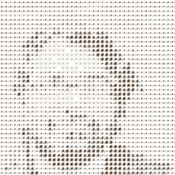
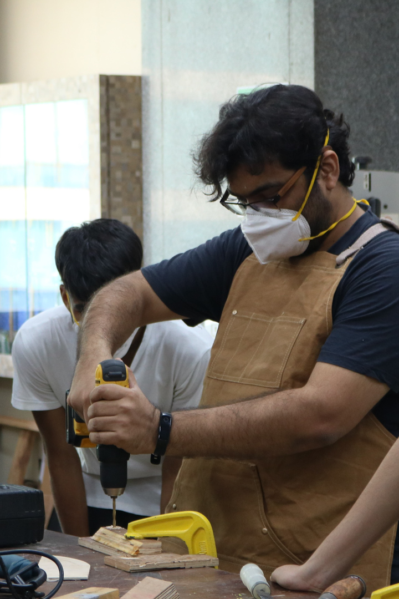
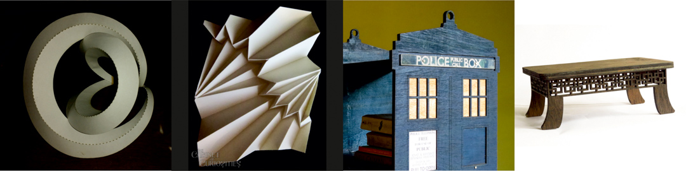
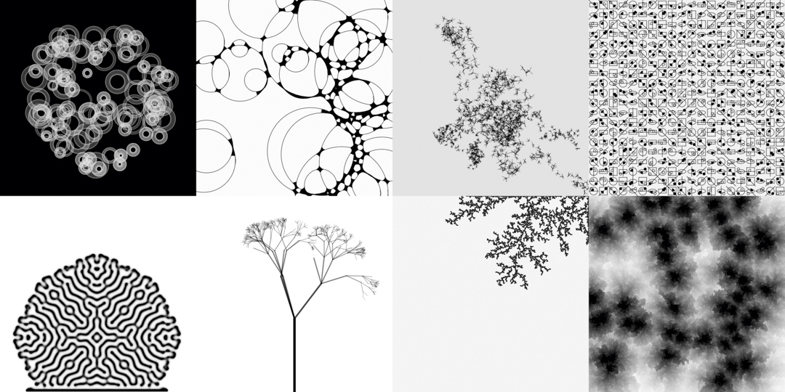
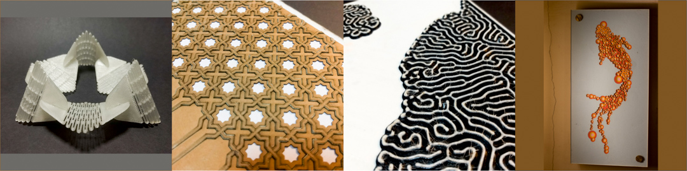
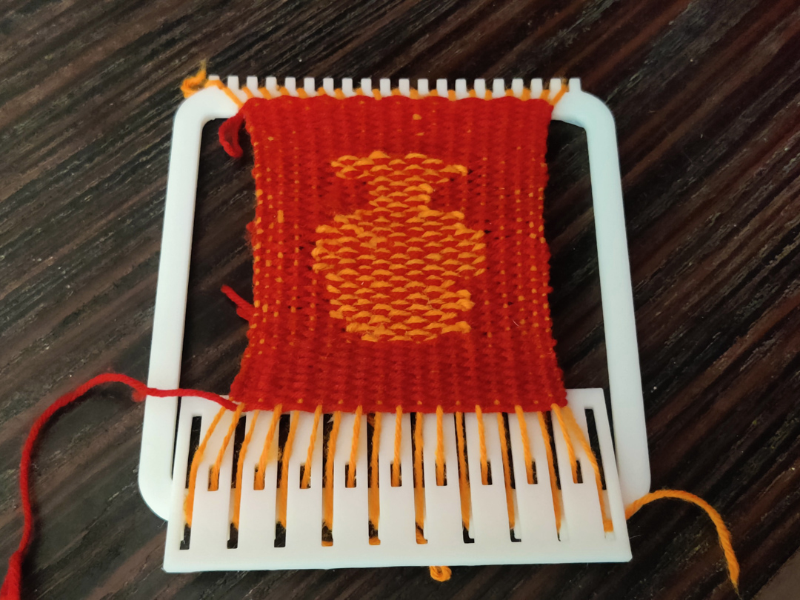
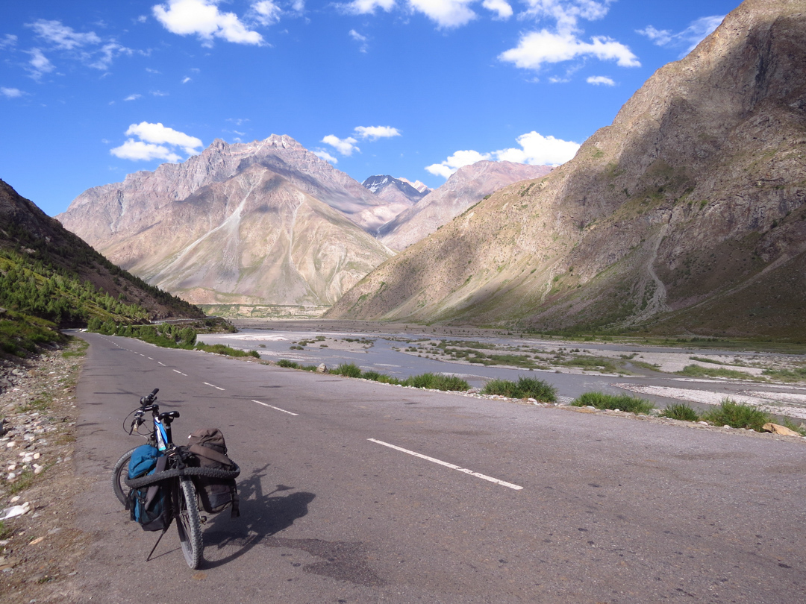

# About me

<!-- List my extensive list of wide ranging interests from geogrpahy and the tibetan plateau to behavioural economics to emerging technologies to object history and other such.

<!-- TODO: add cycling narrative — unsupported Kulu-Leh trips since 2013 with the 
rag-tag 60-somethings, homestays, meeting Tibetan-Buddhist traditions and Nepali/
Jharkhand road crews, the airpump/Samarkand cyclists moment -->

 -->

<picture with bookshelves>
<to do - correct or add links to all the interests>

{width="400" align="right"}  

I am a product designer, educator and maker.  

After working in the industry for several years doing **product design and engineering**, I now **teach** at the Somaiya School of Design, where I am one of the founding faculty. My teaching spans **Material Exploration, Digital Fabrication, Coding and electronics**, and Design Foundations such as **Product Semantics, Interaction, and Data Visualization.** I co-lead the Tangible Products specialisation, where I guide **Lighting and Furniture design.**  

My practice, my learning, and hence my teaching, is usually intensely exploratory and I try to bring in a large component of play. As a lifelong learner looking for the merest excuse, I very often pick things I want to learn more about as things I choose to teach. This works for a while until the teaching requirement plateaus and I get bored.

## Industry Work

I worked in the lighting industry, handling New Product Development for Renata Lighting, where I worked on a family of decor-based lighting. Later in my practice, I worked in healthcare and home automation as well. I have been a consultant for Imaginarium, Nuos, and others.

## Teaching

More [here.](../teaching/index.md)

I started teaching formally at the NMIMS School of Design, where I was early faculty, setting curriculum, setting up the labs, and leading the lab teams as well as library procurement.

I have since moved to the Somaiya School of Design, where I do all of those things as well as manage the labs and projects coming out of the labs, and coordinate the Fab programs I have helped setup.

Before I started teaching formally, I had been taking workshops and talks for a while - at Makers Asylum and elsewhere - on Design Thinking, on Digital Fabrication, and so on. I was also a mentor for a lot of the Maker's Asylum hackathons and STEAM programs.

Today, beyond the classroom, I mentor at hackathons and speak at Virtual Creative Coding Fest, SECIP, and the Fab conferences.

## My Interests

<!-- {width="300" align="right"}   -->

### Makings, Buildings and Play

My interests, personal as well as teaching, range or intersect across the shifting sands of :  

- **Material play** - making, building with [**paper**](https://www.jesalmehta.com/explorations/folding-curves-to-infinity/), clay, [**wood**](https://www.jesalmehta.com/cabinet-of-curiosities/tardis-bookshelf), concrete, resin, glass and metal, and craftsmanship of any kind

  

- **Digital play** - [**procedural generation**](https://www.behance.net/jesmehta#), [**quirky webpages**](https://jesmehta.github.io/DotMandalaGenerator/), [**bots**](https://jesmehta.github.io/CabinetOfCuriosities/traceryBots/), [**data art**](https://www.jesalmehta.com/explorations/coding-a-population-density-visual/), new media

  

- [**Closing the circle between the material and the digital**](https://jesmehta.github.io/CabinetOfCuriosities/fffx/PackingShapes/) - [**digital fabrication**](https://www.jesalmehta.com/cabinet-of-curiosities/), plotter art <insert images>, 3d scanning, [**interactive electronics**](https://fabacademy.org/2023/labs/riidl/students/jesal-mehta/project_final/)

 

- **Traditional crafts**, and their interaction with modern technology <insert dokra>

Beyond my obvious affinities with Design and Fabrication, I have also been studying (somewhat sporadically)  

- **history** : prehistory, protohistory, Big History, and with an interest in the British Raj, himalayan explorations and cartography  
- **culinary anthropology** : the study of how food and society shape each other, through the lenses of culture and history, geography and climate, economics, caste and religion, diaspora, politics, production and supply, and everything else, and with deep dives into Indian food traditions - desserts, alcohols, etc  
- **futuring techniques**, speculative design, critical design and making.

Apart from the above approaches, some areas that I am deeply interested in

{width="400"}

- [**Knotwork**](https://www.instagram.com/p/CzRVwPJooXj/) and [**weaving**](https://jesmehta.github.io/CabinetOfCuriosities/mini_loom/)
- [**Origami**](https://www.facebook.com/media/set/?set=a.797008250367935&type=3), Kirigami, folds and pleats
- Math and/in Nature as well as [**Math based art**](https://www.jesalmehta.com/explorations/polyhedra/)
- Photography, Star gazing, light and optics
- Geometry, especially Islamic Geometric Art
- Mythology
- Language studies and scripts

### Travel, History, and the Crafts

I have travelled multiple times by **bicycle** and foot through **Ladakh**, a region of the **Himalayas**, as well as **Gujarat**, in western India. This slow, local travel has given me a profound appreciation of the land and it's people. It has seeded or been fed by, for example, my interest in **the history and geography of the Himalayan region**, it's **cartography** and **geology**, the **Buddhism and Tibetan art**, and so on, and it is often difficult to say whether I travel there because these interest me, or these interest me because I travel there, but I am deeply moved and hold the region very close to my heart; the Himalayas in genral, and Ladakh in particular.

It began with me reading Kipling’s Kim at an early age, and falling in love with both, the mountains, and the Great Game. My parents and their friends are avid trekkers, rock climbers, and mountaineers, so I’ve grown up trekking in the Sahyadris and later in the Himalayas. Between Kim and the trekking, my fondness for the mountains was inevitable. My interest in the Great Game also gave focus to my existing interest in history and geography. Maps and routes, watersheds and passes, Raj and Empire, opium and tea; I find it all fascinating.

My interest in history also led me down another strange and wonderful route. Since 2020, I have been studying what is officially called “The Studying Food Workshop”, by Dr Kurush Dalaal and his team. As someone who grew up cooking but with only a mild awareness of where food comes from, this suddenly added half a dozen new lenses in my head. Studying politics, diaspora, and various other aspects of society through the medium of food, of how ingredients and recipes change with time, place or social standing, has been utterly fascinating. Deepdiving into specific categories like desserts or alcohols of India was also enlightening. I have since also done courses with Dr Dalaal on prehistory and protohistory of India, some on civilizations in other parts of the world, as well as a fascinating module on the geology of the Indian plate by Dr Raymond Duraiswami.

Similarly, through the **Somaiya School of Design and the Somaiya Kala Vidya**, I have had the privilege of **meeting and being taught** by the **local craftspeople of Kutch**, part of the **desert region of Western India**. This has led to a renewed interest in the **fabric and textile arts, printing, dyeing, weaving** and so on.  

<picture in kutch>

## Lifelong Learner

Formally, semiformally or informally - I keep learning. Skills, knowledge, areas of interest, all is fair game.

I have dived deeper into digital fabrication and rapid prototyping by completing the Fabacademy Diploma in Advanced Prototyping, better known as "How to make (almost) anything", in 2023. 

Across 2025-2026, I am closing on the Fabricademy / Textile Academy Diploma, where I have deep dived into wearables and skin-interfaces, soft robotics, and biomaterials and biocomposites.

Apart from the Fabacademy and Fabricademy diplomas, over the past few years, I have participated or completed a series of courses and workshops

- In early 2026, I finished a diploma in Indian Aesthetics from Mumbai University.
- I am currently enrolled in a Metafutures course on Futuring Techniques, by Sohail Inayatullah, inventor of the Causal Layered Analysis method.
- A Grasshopper course on simulating Origami
- A g-code bending workshop to manipulate 3d printers directly through handwritten gcode.

In the lockdown years, I attended a series of courses by Instucen on  

- The Geology of the Indian Tectonic Plate
- British Poetry Canon, from the Canterbury Tales to the Wasteland

History  

- Prehistory
- Protohistory
- Civilisations of West Asia
- Indic scripts

With Dr Kurush Dalal, the Gyan Factory and the Studying food workshop team,  

- The Studying Food Workshop
- Food and Politics
- Food and Diaspora
- Desi Desserts
- Desi Daaru
- Food and Politics 2

## The road goes ever on and on..

I read a lot of science fiction, graphic novels, and poetry. Occasionally, I write some.  

I am currently rebuilding my rock collection.

<picture of rock>