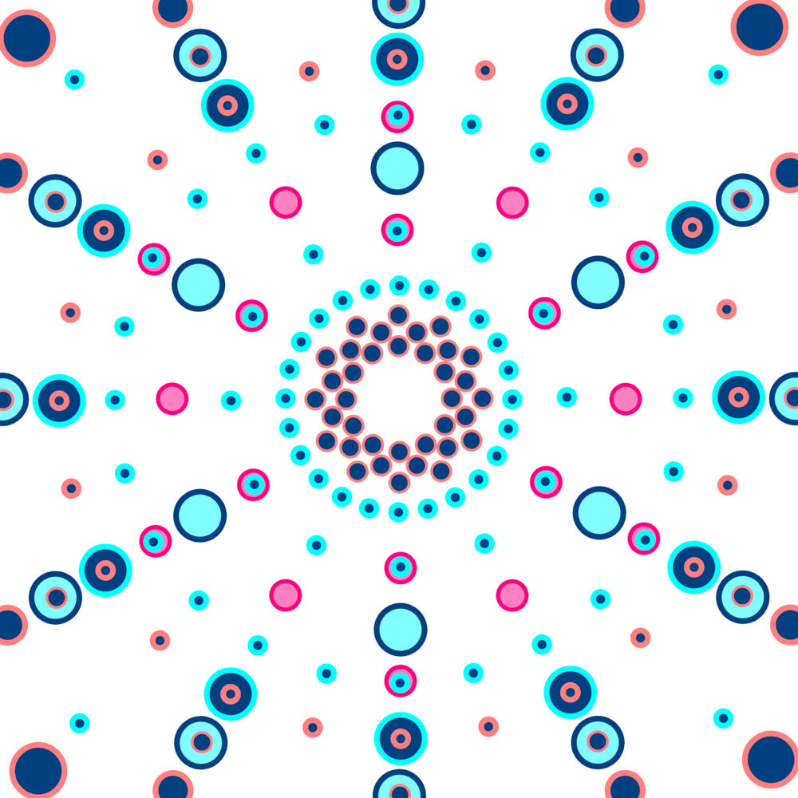
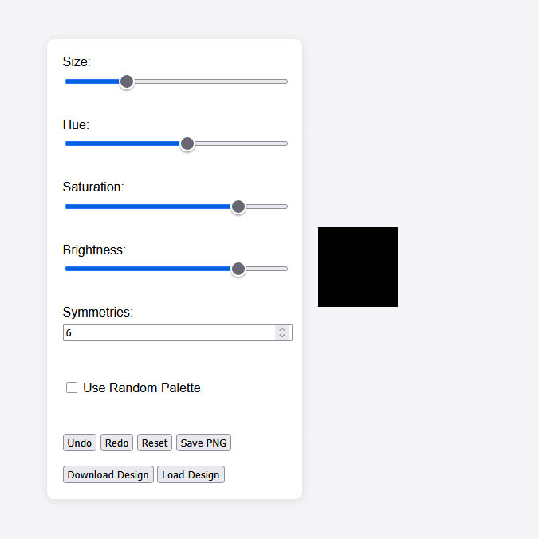
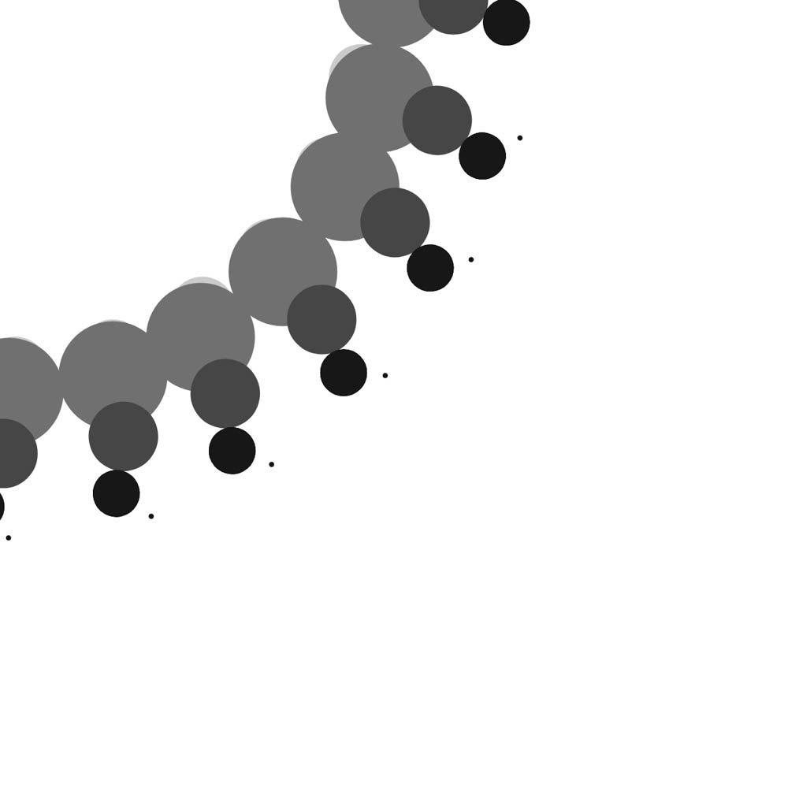
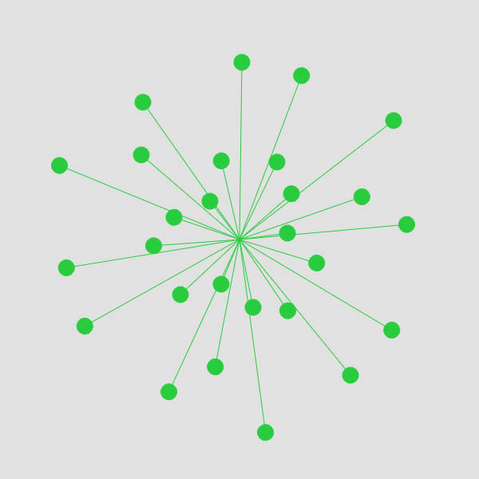
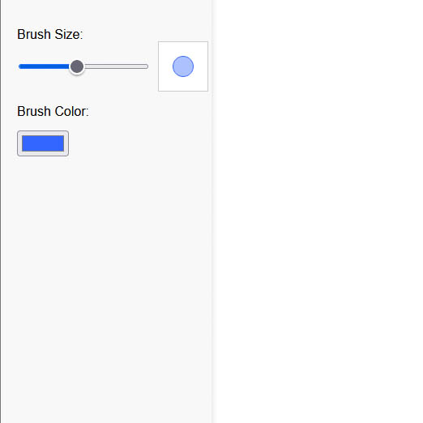
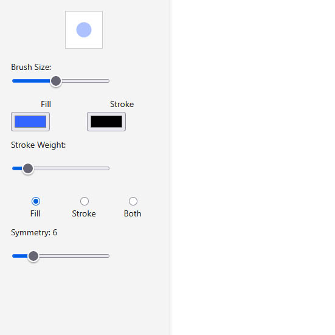
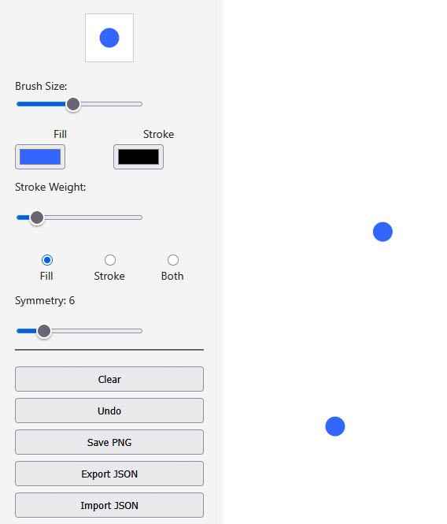
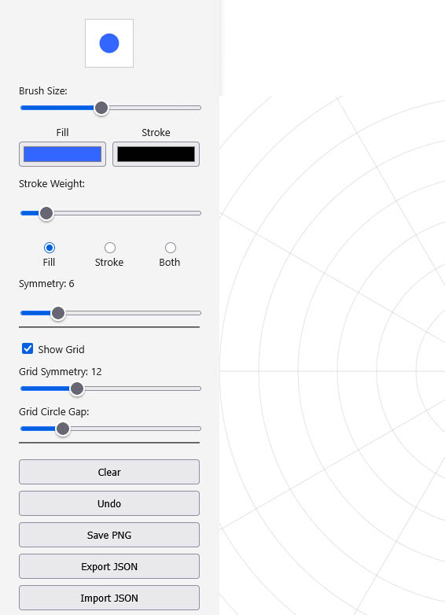
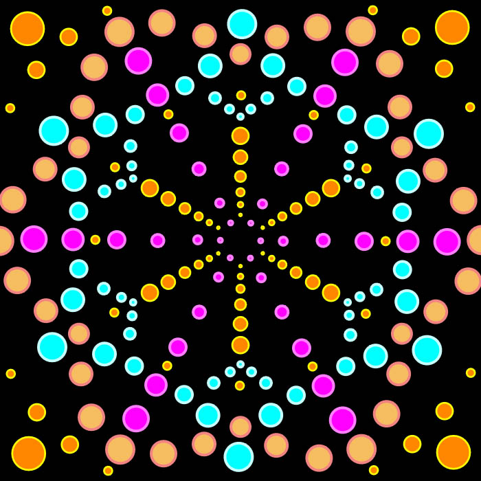
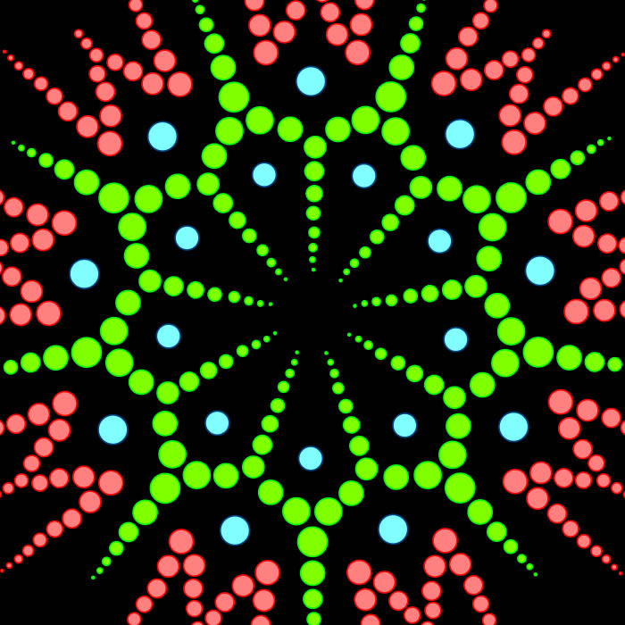

# Dot Mandala Creator

A drawing tool that lets you create patterns on a circular grid.
I also allows you to save the image, export the data and reload the data at a later date for more modifications.
Have fun !

<!-- 

  <iframe src="https://jesmehta.github.io/DotMandalaGenerator/"
          title="Radial Symmetry Canvas"></iframe>

 -->

# [🔗 Open Fullscreen](https://jesmehta.github.io/DotMandalaGenerator/)

## About the Dot Mandala Generator

This project started out a a passing thought. Someone gifted me a fridge magnet of a hand painted dot mandala. I am not a mandala person but I appreciate the pattern and symmetry.

So I got to thinking how the artist managed to create the patterns. Which led to thoughts of a circular/polar grid, and if I could generate variable polar grids with code. And suddenly I am having a full scale vision of a Dot Mandala tool, because why stop at grids, and I am listing out the number of parameters that could be varied to create the dots.

<sketch>

### ChatGPT, HTML and webpages

While I am used to putting up webpages, most of my work is based in markdown, not HTML. I am not a very happy HTML writer. I have little to no experience with HTML + CSS. I either use Markdown and MKDocs for my static pages since a couple of years, or I have added any necessary UI input elements using p5.js directly alongside my generative art sketches.

But I was clear on a few things

- I wanted to explore some HTML  
- I would use ChatGPT to help me do things  
- not being a Mandala fan, this was more of a "let's see if I can" rather than "I want to see the end results and fast" kinds thing, so I was allowing myself to fail  
- not being an HTML fan, I was also completly guilt-free of using ChatGPT to do the work  
- I wanted to see how far ChatGPT could actually do things  

So I started off.  
The first version was me just describing everything to ChatGPT in more-or-less one shot, and it produced a fairly decent outcome with the html, css and js files. Atrocious UI layout and general look and feel though.  
{width="300";}

I started trying to improve it but several things came up  

- the code was completely unreadable to me, even the javascript. This might have worked out if I gave it time, but it would also be a lot of effort.  
- after the initial novelty wore off, of seeing a full page emerge straight out of the primoridial ocean, I realised this was no Birth of Venus that I was witnessing, and that applying makeup to a pig is a tedious and thankless job that does nothing to improve the pig  
- I did run out of time, as life continued to happen.  

Eventually I came back for round two.
I took a different approach this time.

First, I had my fun. I wrote the primary logic for the whole thing by hand. Debugged it, got it to run, iterated some improvements and complexities, etc. This was the fun part of coding for me, why would I outsource this ?!  

{width="300";}
{width="300";}

Second, I sat down with ChatGPT again, and built a UI in stages. 

First, only 1 slider for size. Using that single input, I cleaned and debugged (in collab with ChatGPT) all the necessary previews, some look and feel, etc. Then added inputs for colour. Once those were incorporated, and ChatGPT and me had ironed out how to deal with sliders and colour inputs, I finally asked it to add a bunch of sliders and radio buttons for other parameters. After that I asked it for a set of "admin tool" buttons for the save, clear and other functions.  

{width="300";}
{width="300";}
{width="300";}
{width="300";}

Only once this was done, with the UI nicely aligned, padded, etc, did I upload my sketch.js file to ChatGPT and also told it what to look for in terms of the variables that the sketch was using how I expected the inputs from the UI to match that. And this binding of the UI to the sketch also took a few iterations. By this time the HTML was already complex, and now the js file also became extremely complex as well. However, everything was working fine, and things were rather satisfactory.

I added a few more updates after this as well. Palette changes, a dark background, and a few minor tweaks. While the lines of code are quite higher than what I am used to when just writing out my skectches by hand, I am still far more comfortable navigating this compared to earlier. So that is also a success.

I think what worked this time is obvious but to reiterate :

- working in stages - doing one bit at a time kept things clear
- working modularly - doing the sketch, then the html UI separately, and then binding the UI to the sketch
- lots of tweaks where I would ask ChatGPT to change x or y and it would offer me just the changed lines to replace instead of the entire body of code, so I was navigating and familiarising myself with the code all along, and with a purpose. That is not to say I never had ChatGPT overwrite the entire code, but usually atleast for changes I did, they were inserted without pasting over the full code.
- working for joy - I already had the satisfaction of writing the core logic on my own, so I did have a reward from writing the code and seeing it work, instead of feeling cold and distant from it. The raw code version of it continues to exist as a separate branch of the project as well.

Anyway, while I am not suddenly adept at HTML and CSS, my familiarity with them has only improved. p5.js remains an old friend. ChatGPT is the newest tool in the toolkit, one that I am wary of, and often annoyed with, but also quite enthusiastic about using it for domains of coding that I otherwise wouldn't be bothering with.

Cheers.

{width="300";}
{width="300";}
