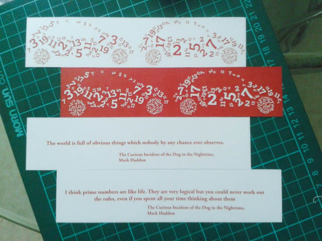
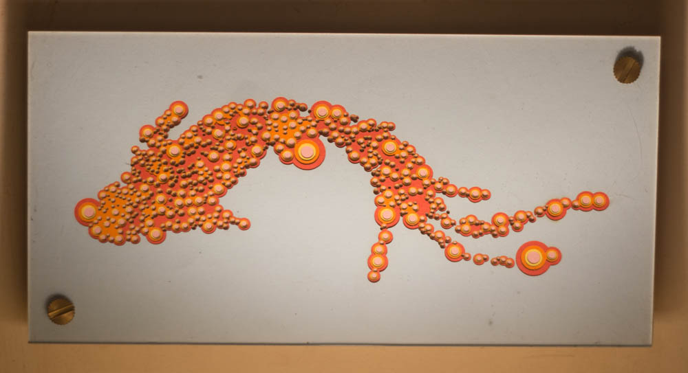
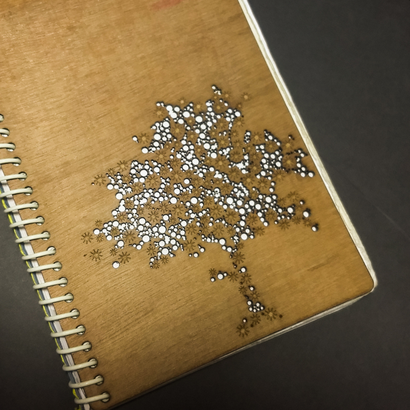
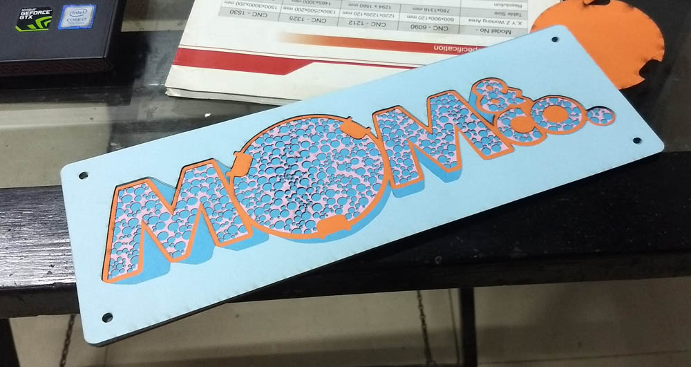
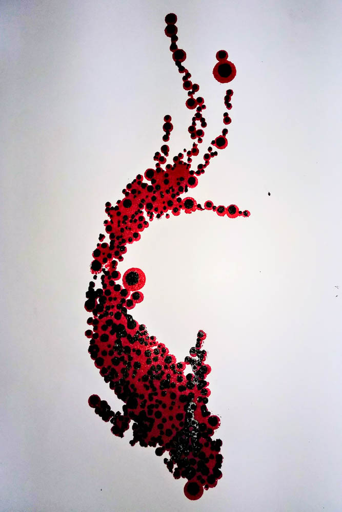

# From Bookclubs to Libraries : CirclePacking with code

*[Find the CirclePacking Library here, with examples and applications](https://jesmehta.github.io/p5-circle-packing/)*

Back in the early 20-teens, I was part of a rather fun book club. We used to have a book-of-the-month chosen by that month's person, and when it fell to me, the book I chose was Mark Haddon's amazing "[The Curious Incident of the Dog in the Nighttime](https://www.goodreads.com/book/show/1618.The_Curious_Incident_of_the_Dog_in_the_Night_Time)".

One of the traditions that evolved was that alongwith choosing the book, the person could come up with a bunch of activities to generate discussions, small takeaways, and custom bookmarks.

So I set about designing my bookmark, which involved a lot of prime numbers and a car (read the book !)

  
*(2015 cellphone cameras... <shrugs\>)*

That's when I first came across the concept of packing shapes together - dense, touching, but not overlapping. I used an Adobe Illustrator script I found online for this (which has been lost to time and multiple laptop changes.)

Sometime in 2018, I found Processing, and [Dan Shiffman](https://thecodingtrain.com/), and all the rest of that amazing, wonderful world, and I was hooked. I used [Dan's Circle Packing coding challenge]((https://youtu.be/QHEQuoIKgNE)) to mess with packings and played with those for a while.

Having access to a lasercutter at [Maker's Asylum](https://www.instagram.com/makersasylum/), and having figured how to export SVGs from Processing, it was only a matter of time before I decided to go from code to material. 

**Digital, after all, can mean both - of numbers, and of fingers.**

I decided to start with a random clipart I found online, of a Koi fish, just to test the concept. It seemed to work, and after a bit of work, I managed to export the SVGs. 

This was also a time when I had been meaning to play with papercuts. Having done one papercut version, I realised this was a great way to layer up the complexity, literally and figuratively.

Unfortunately, I did not think of going back to the code to get smaller circles, but relied on Illustrator and using "transform at location" to shrink each circle without moving them. In the future, I would simply write this into the code.

The result was one of my personal favourites.

Later, I used the same process, but diversified from circles to other shapes to create a [notebook cover](https://www.jesalmehta.com/cabinet-of-curiosities/notebook-covers) for myself, as well as got comissioned to do a gift for the [Mom&Co webseries](https://www.imdb.com/title/tt9752814/).

  

I also used the same process to make lasercut stencils as well, using the different circle sizes to layer the colours.

Eventually, in about 2021, I started rewriting the Circle Packing code from scratch, since I realised I did not need it to animate and grow, etc, like in Dan's example, but just needed a field of shapes to do further work with. Based on my file dates, I seem to have worked on this in 2021 and come back in 2023.

---

Alongside, I had really dived deep into other digital fabrication, including 3D printing, plotting, etc. 

This particular experiment was the first of many in where one would start off in the physical realm, digitise something and transform it further using code or other tools in the digital realm, and then bring it back into the material realm using digital fabrication processes.

---

A quick aside on this theme :

[3D Print of a Menger Square coded in Processing ](https://fabacademy.org/2023/labs/riidl/students/jesal-mehta/weekly/week5/#menger-sponge)  

[3D scan of a chair draped with a sheet ](https://fabacademy.org/2023/labs/riidl/students/jesal-mehta/weekly/week5/#3d-scanning)  

---

In 2024, I was accepted to do a workshop at Fab24 in Mexico on bringing the digital to the physical, but I could not make it to Mexico then. I had also proposed a similar workshop for CCFest sometime in 2021 but we went ahead with a different topic.

Finally, in 2025, towards the end of a small sabbatical, [Saber Khan](https://www.linkedin.com/in/edsaber/) of [CCFest](https://ccfest.rocks/) sent out a call for workshops, and I figured this was a great moment to dust the cobwebs off this and rework it for the present. 

I decided that it would be rather useful to have this as an accessible library - well, micro-library - hosted on github, than to keep copy-pasting code and messing things up. So, I tidied up the last few bits, converted the sketch to a clean, standalone function, and with some help from ChatGPT on standard conventions and how-tos, launched a repo, some versioning, a dist, and other such, which lets me link to and use the function without too much hassle.

I intend to use it for my workshop participants, and my students in the future, but I am just happy to have brought it out into the world at all. If I am the most frequent user of this library, I will neither be surprised nor dsappointed. 

And that is the story that starts from a book club and ends in a library.

*[Find the CirclePacking Library here, with examples and applications](https://jesmehta.github.io/p5-circle-packing/)*

