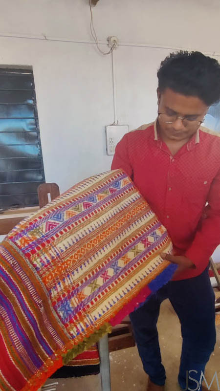
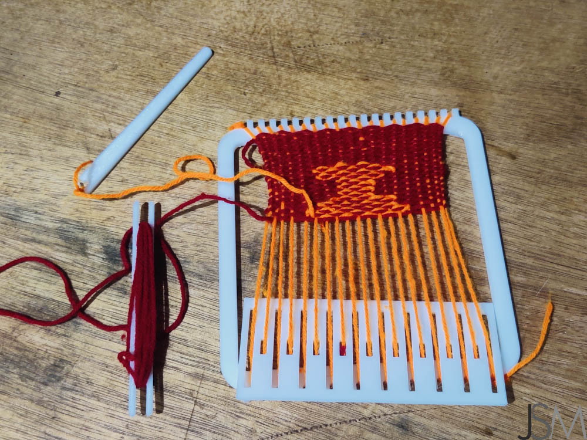

# MiniLoom
  

Looms are used to weave fabric, but stories are woven as well. Fabrications, literally.  

And much can be woven into the weave - some  colour, names, a hair from a friend, or cotton tufts picked off thorn bushes in the warm dusty evening, snagged there by the wind when the Bombax blooms have turned to pods and exploded in the summer heat.  

This story though is woven of strands of experiences from around the world - Mumbai, Bhujodi, Lima and Thimpu.

## Weaving
I have always been weaving things, since I was a kid. I remeber newspaper strips turned into hats and baskets, and coloured paper strips creating checkerboard patterns. With string as well, I weave, but string lends itself to knotwork as well, which I do a lot more of. And I should write about these at length sometime.

## Kutch
In February 2023, we went to Kutch for a week-long field trip to Somaiya Kala Vidya, for a series of workshops conducted by their alumni artisans. This was my first trip to Kutch, and what an deep dive it was. And I should write about it at length at some point.
{width="300";}
{width="300";}

We centred around Bhuj, beside the iconic Prag Mahal, and visited SKV at Anjar, also home to a temple dedicated to my fabled namesake and his guru, Jesal and Toral. 

However, in Bhujodi, we met the weavers, and I was introduced for the first time to the Kutch technique of the Double-Weft.  
{width="300";}
{width="300";}
{width="600";}

Time was at a premium due to medical crises earlier in the day, so only a couple of students got onto the loom and attempted it, while I watched all agog. This was something new, and I was fascinated.  
{width="300";}
{width="300";}

## From the Andes to the Himalayas - the Peruvians in Bhutan
In August of 2023, I attended Fab23 Bhutan, the Fab conference, and the graduation ceremony for the 2023 cohort, of which I was one. It was brilliant. This one too, in hindsight, I should have (and maybe will) write about sometime.

On day 0, there was an informal meet-and-greet, a fun science-fair of a day organized before the formal conference began. There were workshops being held all day long, cafes abounded the space, and the local students from the schools and Bhutan's amazing Fablabs were showcasing their projects as well.

Among these I found the most extraordinaryily dressed person, full of spirit and delight. I had encountered Walter. Over the next few days, I realized just how much of a ball of energy Walter Arnao Gonzales was, mingling with everyone, happy to teach, jolly and spirited, bridging gaps with his enthusiasm so easily that it left needing a common language behind.  
{width="500";}

Walter and his team were doing a workshop with local school kids, showing them how to use this portable loom they had created and seemed to be giving away. I had quick look at it among the hubbub, and decided this was something I would chase down on my own. Luckily I managed to get some good pictures.  
{width="300";}
{width="300";}

## I am down with the flu

I get back from the trip, and a couple of weeks later, I am down with a flu. Since screentime would tire me out completely, I needed a more hands on activity. Of craftsy hobbies, I have no dearth, but for some reason, I struck on trying to make the loom I had seen weeks ago, and try out the new technique I saw months ago.

With no lasercutter at hand, I used Fusion360 to model a 3D printable version. My trusty Prusa printed out the frame, shuttle, needle and comb. A bit of heatgun and lighter flame got rid of splinters to prevent snagging. I had some wool lying around, so strung that up as both warp and weft, and off I went.  
{width="300";}
{width="300";}
{width="300";}
{width="300";}

I started off plain but then added a double weft strand to start creating a pattern. The Kutch standard is to increase or decrease by one warp on every weft, so the patterns are always made of triangular forms. I considered ways of altering this, and essentially treated the whole motif as a pixel map. If I did not always change the number of warp threads engaged by the second weft, or did not change the number at a constant rate, I could modulate the margin to form curves rather than diagonals. And that is what I did. I started off with some idea of making a fish, but finally wrapped it up to be a kalash. But the curves work !  

{width="300";}
{width="300";}
  

The other change was working with a "needle" where the original technique just calls for the extra weft to be added by hand. But I knew the wool was thicker and the gap to pass the shuttle between the warp layers was small, so the needle made sense.  

{width="300";}
{width="300";}  
{width="300";}

Finally I finished off with the plaiting technique I had seen in Bhujodi as well, and snipped off the strands to slip them off the loom edge and comb. This latter half and the finishing I managed to complete on a long car ride another few weeks later, going to Alibag where I was taking a much needed break.  

  

## Note to Self

At some point, I redesigned and reprinted the needle since the first one's eye kept letting the wool slip.  
{width="300";}
{width="300";}

The comb can be better designed as well, to allow easier setup.  
And the 3d printed teeth are strong enough that I should try a finer toothed version that allows more warp threads.
And certainly, the wool looks good, but a finer thread with the larger number of warps would work better.  

I'll get around to it one of these days.

## Fin
Anyway, that's the story of this Mumbai guy doing a Kutchi technique on a Peruvian frame that he learnt of in Bhutan.  
Cheers.

