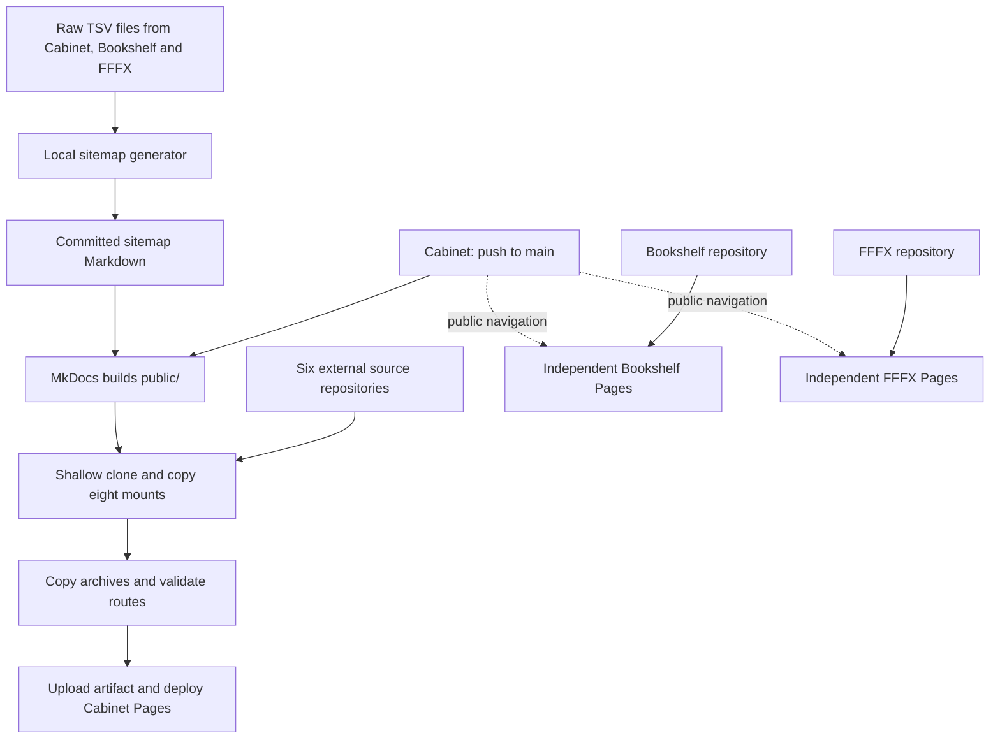

**GitHub Pro supports private source repositories with public Pages sites, but this repository cannot undergo a blanket visibility change without breaking existing dependencies.** Six external repositories are fetched during every Cabinet deployment without private-repository authentication. Cabinet, Bookshelf and FFFX also feed an unauthenticated sitemap-generation tool. [GitHub Pages eligibility](https://docs.github.com/en/pages/getting-started-with-github-pages/what-is-github-pages)

I audited Cabinet’s current `main` at `9f8185d`, the available sibling repositories, assembly checkouts, documentation, and public GitHub metadata. Cabinet, Bookshelf and FFFX’s latest successful deployment runs match their local commits. All eleven GitHub repositories identified below currently report public visibility and Pages enabled. I made no changes; existing uncommitted documentation edits remain untouched.

**Actual deployment architecture**

The authoritative pipeline is [`.github/workflows/deploy.yml`](F:/__SnowCrash/__WebPages/CabinetOfCuriosities/.github/workflows/deploy.yml:1):

1. **Trigger:** a push to Cabinet’s `main`. There is no `workflow_dispatch`, `repository_dispatch`, schedule, or source-repository trigger.
2. Check out Cabinet using `actions/checkout@v4`; configure Python and Node 20.
3. Install Python packages from `requirements.txt`.
4. Reject `docs/index.md`, because the homepage is the committed standalone `docs/index.html`.
5. Regenerate Cabinet/Now content and fail if the generated files differ from their committed versions.
6. Run `mkdocs build --site-dir public --strict`.
7. Run `tools/assemble-external.js --public-dir public`.
8. Copy `archived-landing-pages/` into the deployment.
9. Validate local deployment routes.
10. Upload `public/`; a separate dependent job deploys it using GitHub Pages.

The homepage’s Playwright build and promotion scripts are **local authoring operations**, not CI steps. CI consumes their committed HTML/CSS/JS output.

External assembly is specifically **clone-and-copy**, not a build of each external project:

- Read active rows from `content/external-repos.tsv`.
- Run `git clone --depth 1 https://github.com/<owner>/<repo>.git`.
- Copy the repository root or specified subfolder.
- Remove the copied root `.git`.
- Check destination collisions and required files/content.
- Fail the build if any project fails.

There is no branch/ref column or commit pin: each clone takes the remote default branch’s current tip. SSD is cloned separately for each of its three manifest rows.

Sources: [manifest](F:/__SnowCrash/__WebPages/CabinetOfCuriosities/content/external-repos.tsv:1), [assembly implementation](F:/__SnowCrash/__WebPages/CabinetOfCuriosities/tools/assemble-external.js:49), [route validator](F:/__SnowCrash/__WebPages/CabinetOfCuriosities/tools/validate-deployment.js:1).

**Repository classification and privatization consequences**

“Immediately” below distinguishes keeping the public sites operational from preserving every existing maintenance operation. Pro eligibility assumes these repositories remain owned by the subscribed personal account.

| Repository | Actual classification | Private immediately under Pro? | Authentication/workflow consequence |
|---|---|---|---|
| `jesmehta/CabinetOfCuriosities` | Main independently deployed site; assembles six external repositories | **Yes for deployment; no for unchanged maintenance** | Its own checkout and Pages deployment already use repository-scoped Actions authentication. However, its sitemap tool fetches Cabinet’s own TSVs anonymously from GitHub Raw and would fail after privatization. |
| `jesmehta/TheBookshelfOfCuriosities` | **Independently deployed**, linked from Cabinet; also an authoring-data dependency | **Yes for its public site; no for unchanged sitemap regeneration** | Its workflow builds only its own sources. Cabinet’s sitemap generator requires authenticated access once Bookshelf becomes private. No Bookshelf content is cloned during Cabinet CI. |
| `jesmehta/form-follows-fx` | **Independently deployed**, linked from Cabinet; also an authoring-data dependency | **Yes for its public site; no for unchanged sitemap regeneration** | Same distinction as Bookshelf. FFFX’s own workflow has no external project checkout. |
| `jesmehta/working-with-ai` | **Copied during Cabinet build**, plus independently deployed Pages | **No, preserving Cabinet rebuilds** | Cabinet’s clone needs access to this private repository first. Its separate Pages deployment does not supply Cabinet with credentials. |
| `jesmehta/PromptGenerator` | **Copied during Cabinet build**, plus independently deployed Pages | **No** | Same private-source clone requirement. FFFX also links directly to its independent Pages site. |
| `jesmehta/ObliqueStrategies` | **Copied during Cabinet build**, plus independently deployed Pages | **No** | Same clone requirement. Its separate Pages site is also linked from FFFX. |
| `jesmehta/SSD_Student_Work` | **Three subfolders copied during Cabinet build**, plus independently deployed Pages and direct teaching links | **No** | All three Cabinet clones require private-repo access. Other SSD content remains dependent on SSD’s own public Pages deployment. |
| `jesmehta/swatchFields` | **Copied during Cabinet build**, plus independently deployed Pages | **No** | Cabinet needs private-source clone access first. Existing page metadata also references its independent Pages URL/image. |
| `jesmehta/TraceryBots` | **Copied during Cabinet build**, plus independently deployed Pages | **No** | Cabinet needs private-source clone access first. Cabinet embeds the assembled Trippy Gourmet app. |
| `jesmehta/DotMandalaGenerator` | **Independently deployed; runtime iframe and links**, not assembled | **Yes, for the audited dependency** | Cabinet loads its public Pages URL. No Cabinet build authentication is involved. The app loads local scripts and public CDN p5.js, not private GitHub source. |
| `jesmehta/p5-circle-packing` | **Linked-only from Cabinet; independently deployed examples linked from FFFX; additional public-library distribution dependency** | **Yes for Pages; not an unconditional yes for the library’s existing distribution** | Cabinet/FFFX builds do not fetch it. Public GitHub source links become inaccessible. Its README also advertises GitHub-backed jsDelivr delivery, discussed below. |

The six assembled repositories have their own successful GitHub-generated `pages build and deployment` runs, despite having **no checked-in `.github/workflows` files**. Their independent Pages deployments and Cabinet’s copies are separate publication paths.

For the six clone dependencies, **GitHub Pro alone is insufficient**: Cabinet’s workflow token is scoped to Cabinet, not to other private repositories owned by the same person. The current script/workflow supplies no cross-repository credential. Preserving assembly therefore requires authenticated access in that execution path before those sources become private. [GitHub’s token scope documentation](https://docs.github.com/en/actions/concepts/security/github_token)

If one becomes private first, the next Cabinet assembly fails and the dependent deploy job does not run. That does not remove the external files already present in Cabinet’s previously deployed artifact.

**Exact assembly map**

All eight rows are currently active:

| Source repository | Source copied | Cabinet destination |
|---|---|---|
| `working-with-ai` | Repository root | `/teaching/working-with-ai/` |
| `PromptGenerator` | Repository root | `/teaching/prompt-generator/` |
| `ObliqueStrategies` | Repository root | `/teaching/oblique-strategies/` |
| `SSD_Student_Work` | `ssd-creative-coding-2025-26/` | `/teaching/ssd-creative-coding-2025-26/` |
| `SSD_Student_Work` | `ssd-creative-coding-2024-25/` | `/teaching/ssd-creative-coding-2024-25/` |
| `SSD_Student_Work` | `ssd-creative-coding-2023-24/` | `/teaching/ssd-creative-coding-2023-24/` |
| `swatchFields` | Repository root | `/swatch-fields/` |
| `TraceryBots` | Repository root | `/tracery-bots/` |

This is defined by the deployment manifest, not by the landing-page entries or MkDocs navigation.

Naming distinctions:

- **“Prompt Generators” is a local container directory.** The deployed repository is `jesmehta/PromptGenerator`, represented by one manifest row.
- Local **`SSD_CreativeCodingPage` points to `jesmehta/SSD_Student_Work`**. The older name also survives in archived landing-page links; it is not another current source dependency.
- `ssd-emergent-tech-2026-27/` is **not assembled**. [Teaching’s hub](F:/__SnowCrash/__WebPages/CabinetOfCuriosities/docs/teaching/index.md:11) links to SSD’s independent Pages deployment.
- Playing with Pulp, Dragons of SSD, and the Cabinet teaching hub are native Cabinet Markdown/assets.
- Cabinet’s current Writings content was migrated from Bookshelf and is now local. That historical migration is not an ongoing build dependency.

**Bookshelf and FFFX have a hidden maintenance dependency**

[`tools/generate_sitemap.py`](F:/__SnowCrash/__WebPages/CabinetOfCuriosities/tools/generate_sitemap.py:55) anonymously downloads two TSV files from each of:

- `jesmehta/CabinetOfCuriosities`, branch `main`;
- `jesmehta/form-follows-fx`, branch `main`;
- `jesmehta/TheBookshelfOfCuriosities`, branch `main`.

It uses `urllib.request.urlopen()` against `raw.githubusercontent.com`, with no authorization header or local-source fallback.

This script runs locally, including through the admin dashboard. **It is not invoked by Cabinet’s deployment workflow.** Consequently:

- Privatizing any of the three breaks the next sitemap-generation invocation.
- The already committed sitemap remains buildable and publicly viewable.
- The script fetches all three worlds before writing its outputs; a fetch failure also prevents that invocation from updating `CONTENT-INVENTORY.md`.

Bookshelf’s own workflow builds MkDocs and copies its **local** `projects/*/` directories into `public/`. FFFX’s workflow builds its own MkDocs tree. Neither assembles Cabinet’s six external repositories.

Sources: [Bookshelf workflow](F:/__SnowCrash/__WebPages/TheBookshelfOfCuriosities/.github/workflows/deploy.yml:1), [FFFX workflow](F:/__SnowCrash/__WebPages/form-follows-fx/.github/workflows/deploy.yml:1).

**Fab repositories are separate GitLab deployments**

The five sites linked from [Cabinet’s Fab hub](F:/__SnowCrash/__WebPages/CabinetOfCuriosities/docs/fab/index.md:10) resolve to these repositories, verified through the local remotes:

| Repository on `gitlab.fabcloud.org` | Classification | GitHub Pro privatization answer |
|---|---|---|
| `academany/fabacademy/2023/labs/riidl/students/jesal-mehta` | Independently deployed; linked from Cabinet; FFFX additionally loads images from its public site | **Not applicable** |
| `academany/fabricademy/2026/students/jesal-mehta` | Independently deployed; linked-only from Cabinet | **Not applicable** |
| `academany/fabacademy/2024/labs/riidl/site` | Independently deployed; linked-only from Cabinet | **Not applicable** |
| `academany/fabacademy/2025/labs/riidl/site` | Independently deployed; linked-only from Cabinet | **Not applicable** |
| `academany/fabacademy/2026/labs/riidl/site` | Independently deployed; linked-only from Cabinet | **Not applicable** |

Each inspected `.gitlab-ci.yml` installs its own requirements, builds MkDocs into `public/`, and publishes a Pages artifact on the default branch. Cabinet does not clone these repositories.

No Cabinet authentication/workflow change is required merely because their source visibility changes. However, whether Fabcloud permits private source with publicly accessible Pages depends on its GitLab settings and permissions, which this audit did not establish. GitHub Pro provides no entitlement there.

`RiidlDeploy` and `RiidlDeploy2` are additional local checkouts of the **same 2024 RIIDL repository**, not separate dependencies.

**Other dependencies and important boundaries**

- **No Git submodules:** Cabinet has neither `.gitmodules` nor tracked mode-`160000` entries. Public `main` trees for the eleven GitHub repositories likewise showed no submodule entries. `WORLD-SYSTEMS.md` explicitly describes manually duplicated, manually synchronized documentation.
- **Public library distribution:** [p5-circle-packing’s README](<F:/__SnowCrash/__WebPages/Library Repos/p5-circle-packing/README.md:19>) advertises `cdn.jsdelivr.net/gh/jesmehta/p5-circle-packing@v0.9.0/dist/CirclePack.js`. This depends on public GitHub-backed distribution, unlike its examples’ Pages-hosted script URL. Existing cached files may persist; that does not establish continued availability of uncached files or future private releases. jsDelivr documents permanent storage of fetched files. [jsDelivr documentation](https://github.com/jsdelivr/jsdelivr)
- **Build infrastructure:** Cabinet uses the public `actions/checkout`, `setup-python`, `setup-node`, `configure-pages`, `upload-pages-artifact`, and `deploy-pages` repositories. Python packages come from `requirements.txt`; Playwright is a local landing-build dependency. No private package registry or private reusable workflow appears in the inspected implementation.
- **Cloudflare:** the checked-in implementation adds Web Analytics. Cabinet publication is GitHub Pages; the concept note’s Cloudflare routing option is not an implemented assembly mechanism.
- **Validation scope:** the route validator checks the assembled local tree and deliberately skips external destinations. A successful Cabinet build does not prove Bookshelf, FFFX, Fab sites, or embedded external apps are reachable.
- **Publication scope:** root-mounted projects are recursively copied, with only their root `.git` removed. They are not reduced to a filtered production bundle. Making their repositories private would not make files already copied into the public site private.

Some documentation describes future per-project builds, manual deployment triggers, or possible galleries. The current implementation contains **no external build commands, no manual-dispatch trigger, and no Rock Collection/Dupatta Collection repository mounts**.

These conclusions establish the current dependency map and the prerequisites implied by it. They do not certify account subscription status, private Pages settings, or uninterrupted URLs during a visibility transition; those settings were not changed or tested.
